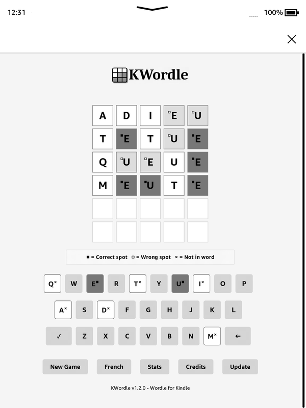

# KWordle

Wordle for Kindle e-readers.<br />

<p>
  <a href="https://ko-fi.com/kurizu" target="_blank">
    
  </a>
</p>

## Overview

KWordle is a version of the popular word-guessing game Wordle, specifically designed to work on Kindle e-readers. It features:

- 5-letter word guessing gameplay
- Special indicators for letter positions that work well on black & white displays
- Multiple languages (English, French, German, Spanish, Portuguese)
- Keyboard input support
- Game statistics tracking

## How to Install

1. Download the latest release from the [GitHub repository](https://github.com/crizmo/KWordle/releases).
2. If you are on a legacy model ( 5.6.1.1 or older), download the `kwordle-legacy.zip` file. For newer models, download the `kwordle.zip` file.
3. Unzip the downloaded file.
4. Connect your Kindle to your computer using a USB cable.
5. Copy the entire `kwordle` folder and `kwordle.sh` file to the **Documents** folder of your Kindle.
6. Safely eject your Kindle from your computer.
7. On your Kindle, open the **KWordle** booklet to start playing.

## Setup & Installation

1. Download this repository
2. Connect your Kindle to your computer
3. Copy the entire `kwordle` folder and `kwordle.sh` to the **Documents** folder of your Kindle
4. Disconnect your Kindle.
5. Open the **KWordle** booklet on your Kindle to start the game.

## How to Play

1. The game selects a random 5-letter word
2. You have 6 attempts to guess the word
3. After each guess, you'll see indicators for each letter:
   - ■ (filled square) means the letter is in the correct position
   - □ (empty square) means the letter is in the word but in the wrong position
   - × means the letter is not in the word
4. Use the on-screen keyboard or your Kindle's keyboard to enter guesses
5. Press "Enter" to submit a guess
6. Try to guess the word in as few attempts as possible!

## Technical Details

- Compatible with Kindle's WebKit-based browser
- Uses ES5 JavaScript for maximum compatibility with older Kindle models
- Optimized for Kindle's screen size and black & white display
- Includes polyfills for older browsers
- Stores game statistics in localStorage

## Adding new languages

In order to add a new language, you need 2 lists: the guessing word list and the accepted word list. The second one is usually much longer, as it should contain all 5 letter words of the language. The guessing list contains a good collection of usual words. The 2 lists can be the same.

If the language contains accented characters (like "é", "ç" etc.), replace them with the non-accented variants ("e", "c" etc.)

Arrange the 2 lists in the following format:
```
["word1","word2","word3"],
```

Copy the lists in the `words.js` file, at the declaration of the `wordList` and `accepted` variables (just before the `];` lines).

Then add the language at the end of the `languageList` variable (`main.js` line 15).

Don't forget to add the credits to the creators of the word list in the `showCredits()` function!

Check Github for word lists on different languages, like [Hugo0's Wordle repo](https://github.com/Hugo0/wordle)

## Credits
- Game by [kurizu](https://kurizu.vercel.app/)
- Illusion engine by [Penguins184](https://github.com/polish-penguin-dev/)
- Additional development by [kbarni](https://github.com/kbarni)
- Word lists by:
  - English: [Sean Patlan](https://github.com/seanpatlan/wordle-words)
  - French: [Simon Cambier](https://github.com/scambier/mo-mo-motus)
  - German: [Katherine Oelsner](https://github.com/octokatherine/word-master)
  - Spanish: [jeheda](https://github.com/jeheda)
  - Portuguese: [Victor Santos](https://github.com/tilnoene)
  - Swedish [Jesper Olsson](https://github.com/jsprolsson)